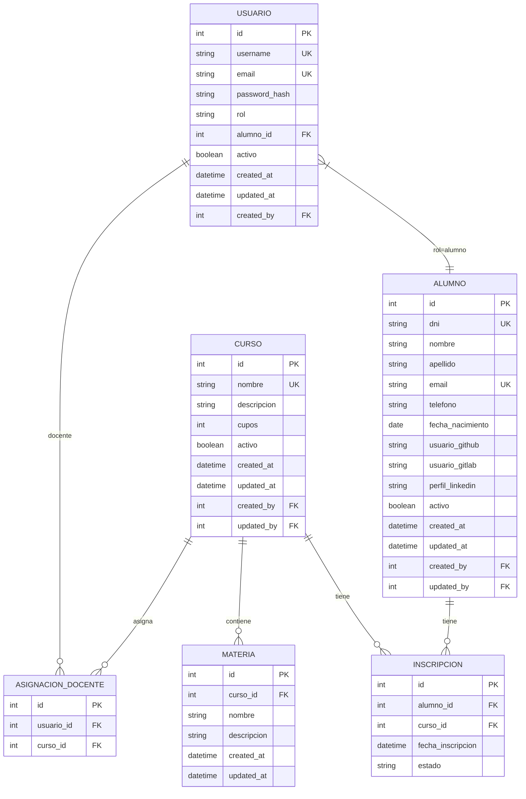

# PLAN.md — Plan de Implementación

**Proyecto:** proyecto_padawans
**Fuente:** [PRD.md](./PRD.md)
**Versión:** 0.1.0

---

## 1. Decisiones Técnicas Clave

| Decisión | Opción Elegida | Justificación |
|----------|----------------|---------------|
| **Python** | 3.12 (conda `py3.12`) | Soporte largo, mejoras async/performance |
| **Framework API** | FastAPI | Async nativo, OpenAPI automático, tipado estricto |
| **ORM** | SQLAlchemy 2.x (async style) | Moderno, type-safe, async nativo con `asyncio` |
| **Driver DB** | `psycopg[binary]` (async) | Wheel binario, sin compilar, soporte async nativo |
| **Migraciones** | Alembic | Estándar con SQLAlchemy, versionado DDL |
| **Auth** | JWT (HS256) + bcrypt | Stateless, simple, expiración 60 min |
| **Validación** | Pydantic v2 | Integrado en FastAPI, performance |
| **Config** | pydantic-settings | Tipado, `.env`, múltiples entornos |
| **Testing** | pytest + pytest-asyncio + httpx | Async tests, TestClient compatible |
| **Lint/Format** | ruff | Rápido, unificado (lint + format) |
| **Type checking** | mypy (strict) | Catch errores en CI |
| **DB local** | Docker Compose (postgres:16) | Consistente, portable, sin instalar local |

---

## 2. Diagramas de Arquitectura y Modelo de Datos

### 2.1 Diagrama Entidad-Relación (ERD)

El siguiente diagrama Mermaid representa el modelo de datos definido en el PRD §6. Se puede visualizar y editar en [mermaid.live](https://mermaid.live).



### 2.2 Arquitectura de la Aplicación (Clean/Hexagonal Simplificada)

```mermaid
flowchart TB
    subgraph EXTERNAL["Clientes Externos"]
        Client["API Consumer\n(Postman, curl, frontend)"]
    end

    subgraph APP["Aplicación FastAPI"]
        direction TB
        
        subgraph API["Capa de Entrada (API v1)"]
            Router["Router Principal\n/api/v1"]
            AuthRouter["Auth Router\n/login, /me"]
            AlumnosRouter["Alumnos Router\nCRUD admin"]
            CursosRouter["Cursos Router\nCRUD admin"]
            MateriasRouter["Materias Router\nCRUD admin"]
            InscripcionesRouter["Inscripciones Router\nAdmin"]
            DocentesRouter["Docentes Router\nAsignación admin"]
            MeDocenteRouter["Me Docente Router\n/docente/me/cursos"]
            MeAlumnoRouter["Me Alumno Router\n/alumno/me/cursos"]
        end

        subgraph DEPS["Dependencias Comunes"]
            GetDB["get_db\nAsyncSession"]
            GetUser["get_current_user\nJWT validation"]
            RequireRole["require_role(*roles)\nRBAC"]
        end

        subgraph SERVICES["Capa de Servicios (Casos de Uso)"]
            AuthService["AuthService\nregister, login, hash, JWT"]
            AlumnoService["AlumnoService\nreglas: unicidad dni/email,\nsoft delete propaga baja"]
            CursoService["CursoService\nreglas: cupos, soft delete\npropaga baja + des-asigna docentes"]
            InscripcionService["InscripcionService\nreglas: cupo < inscripciones_activas,\nunicidad inscripción activa"]
            DocenteService["DocenteService\nvalidar rol docente"]
        end

        subgraph REPOS["Capa de Repositorios (Acceso a Datos)"]
            AlumnoRepo["AlumnoRepository\nCRUD + filtros + paginación"]
            CursoRepo["CursoRepository\nCRUD + filtros"]
            InscripcionRepo["InscripcionRepository\nCRUD + conteo activos"]
            UsuarioRepo["UsuarioRepository\nCRUD + by username/email"]
        end

        subgraph MODELS["Modelos ORM (SQLAlchemy 2.x async)"]
            AlumnoModel["Alumno"]
            CursoModel["Curso"]
            MateriaModel["Materia"]
            InscripcionModel["Inscripcion"]
            AsignacionDocenteModel["AsignacionDocente"]
            UsuarioModel["Usuario"]
        end

        subgraph SCHEMAS["Esquemas Pydantic (DTOs)"]
            AuthSchemas["Auth: LoginRequest, Token,\nUserCreate, UserRead"]
            AlumnoSchemas["Alumno: Create, Update, Read,\nListParams"]
            CursoSchemas["Curso: Create, Update, Read"]
            MateriaSchemas["Materia: Create, Update, Read"]
            InscripcionSchemas["Inscripcion: Create, Read"]
            CommonSchemas["Common: Pagination,\nErrorResponse"]
        end

        subgraph CORE["Núcleo Compartido"]
            Config["config.py\npydantic-settings"]
            Security["security.py\nbcrypt, JWT HS256"]
            Database["database.py\nasync engine, session, Base"]
            Exceptions["exceptions.py\nhandlers, error codes"]
        end
    end

    subgraph INFRA["Infraestructura"]
        Postgres[("PostgreSQL 16\nDocker Compose")]
        Alembic["Alembic\nMigraciones"]
    end

    %% Conexiones
    Client --> Router
    Router --> AuthRouter
    Router --> AlumnosRouter
    Router --> CursosRouter
    Router --> MateriasRouter
    Router --> InscripcionesRouter
    Router --> DocentesRouter
    Router --> MeDocenteRouter
    Router --> MeAlumnoRouter

    AuthRouter --> GetDB
    AuthRouter --> GetUser
    AlumnosRouter --> GetDB
    AlumnosRouter --> GetUser
    AlumnosRouter --> RequireRole
    CursosRouter --> GetDB
    CursosRouter --> GetUser
    CursosRouter --> RequireRole
    MateriasRouter --> GetDB
    MateriasRouter --> GetUser
    MateriasRouter --> RequireRole
    InscripcionesRouter --> GetDB
    InscripcionesRouter --> GetUser
    InscripcionesRouter --> RequireRole
    DocentesRouter --> GetDB
    DocentesRouter --> GetUser
    DocentesRouter --> RequireRole
    MeDocenteRouter --> GetDB
    MeDocenteRouter --> GetUser
    MeDocenteRouter --> RequireRole
    MeAlumnoRouter --> GetDB
    MeAlumnoRouter --> GetUser
    MeAlumnoRouter --> RequireRole

    AuthService --> GetDB
    AuthService --> UsuarioRepo
    AuthService --> Security

    AlumnoService --> GetDB
    AlumnoService --> AlumnoRepo
    AlumnoService --> InscripcionRepo
    CursoService --> GetDB
    CursoService --> CursoRepo
    CursoService --> InscripcionRepo
    CursoService --> DocenteRepo
    InscripcionService --> GetDB
    InscripcionService --> InscripcionRepo
    InscripcionService --> AlumnoRepo
    InscripcionService --> CursoRepo
    DocenteService --> GetDB
    DocenteService --> UsuarioRepo
    DocenteService --> CursoRepo

    AlumnoRepo --> AlumnoModel
    CursoRepo --> CursoModel
    InscripcionRepo --> InscripcionModel
    UsuarioRepo --> UsuarioModel

    AlumnoModel --> Postgres
    CursoModel --> Postgres
    MateriaModel --> Postgres
    InscripcionModel --> Postgres
    AsignacionDocenteModel --> Postgres
    UsuarioModel --> Postgres

    Alembic --> Postgres

    %% Estilos
    classDef external fill:#f7e8b4,stroke:#8a6f2a,color:#1f1f1f;
    classDef api fill:#dbeafe,stroke:#3b5f8a,color:#1f1f1f;
    classDef deps fill:#e0e7ff,stroke:#4f46e5,color:#1f1f1f;
    classDef svc fill:#d9ead3,stroke:#4f7f45,color:#1f1f1f;
    classDef repo fill:#fef3c7,stroke:#d97706,color:#1f1f1f;
    classDef model fill:#fce7f3,stroke:#db2777,color:#1f1f1f;
    classDef schema fill:#e0f2fe,stroke:#0369a1,color:#1f1f1f;
    classDef core fill:#f3f4f6,stroke:#6b7280,color:#1f1f1f;
    classDef infra fill:#e5e7eb,stroke:#374151,color:#1f1f1f;

    class Client external;
    class Router,AuthRouter,AlumnosRouter,CursosRouter,MateriasRouter,InscripcionesRouter,DocentesRouter,MeDocenteRouter,MeAlumnoRouter api;
    class GetDB,GetUser,RequireRole deps;
    class AuthService,AlumnoService,CursoService,InscripcionService,DocenteService svc;
    class AlumnoRepo,CursoRepo,InscripcionRepo,UsuarioRepo repo;
    class AlumnoModel,CursoModel,MateriaModel,InscripcionModel,AsignacionDocenteModel,UsuarioModel model;
    class AuthSchemas,AlumnoSchemas,CursoSchemas,MateriaSchemas,InscripcionSchemas,CommonSchemas schema;
    class Config,Security,Database,Exceptions core;
    class Postgres,Alembic infra;
```



---

## 3. Estructura del Proyecto

```
proyecto_padawans/
├── .github/workflows/        # CI (opcional, fase posterior)
├── app/
│   ├── __init__.py
│   ├── main.py               # FastAPI app factory
│   ├── core/
│   │   ├── __init__.py
│   │   ├── config.py         # pydantic-settings
│   │   ├── security.py       # JWT, bcrypt, deps
│   │   ├── database.py       # engine, session, base
│   │   └── exceptions.py     # Handlers, error codes
│   ├── models/
│   │   ├── __init__.py
│   │   ├── alumno.py
│   │   ├── curso.py
│   │   ├── materia.py
│   │   ├── inscripcion.py
│   │   ├── asignacion_docente.py
│   │   └── usuario.py
│   ├── schemas/
│   │   ├── __init__.py
│   │   ├── alumno.py
│   │   ├── curso.py
│   │   ├── materia.py
│   │   ├── inscripcion.py
│   │   ├── auth.py
│   │   └── common.py         # Pagination, ErrorResponse
│   ├── api/
│   │   ├── __init__.py
│   │   ├── deps.py           # get_db, get_current_user, roles
│   │   ├── v1/
│   │   │   ├── __init__.py
│   │   │   ├── router.py
│   │   │   ├── auth.py
│   │   │   ├── alumnos.py
│   │   │   ├── cursos.py
│   │   │   ├── materias.py
│   │   │   ├── inscripciones.py
│   │   │   ├── docentes.py
│   │   │   ├── me_docente.py
│   │   │   └── me_alumno.py
│   ├── services/
│   │   ├── __init__.py
│   │   ├── alumno_service.py
│   │   ├── curso_service.py
│   │   ├── inscripcion_service.py
│   │   └── auth_service.py
│   └── repositories/
│       ├── __init__.py
│       ├── alumno_repo.py
│       ├── curso_repo.py
│       ├── inscripcion_repo.py
│       └── usuario_repo.py
├── tests/
│   ├── __init__.py
│   ├── conftest.py           # fixtures: db, client, auth
│   ├── unit/
│   │   ├── test_alumno_service.py
│   │   ├── test_curso_service.py
│   │   └── test_auth_service.py
│   └── integration/
│       ├── test_alumnos_api.py
│       ├── test_cursos_api.py
│       ├── test_inscripciones_api.py
│       └── test_auth_api.py
├── alembic/
│   ├── env.py
│   ├── script.py.mako
│   └── versions/
├── docker-compose.yml
├── requirements.txt
├── requirements-dev.txt
├── .env.example
├── pyproject.toml            # ruff, mypy, pytest config
├── README.md
├── PRD.md
├── PLAN.md
└── AGENTS.md
```

---

## 3. Fases de Implementación

### Fase 0: Bootstrap (base del proyecto)
- [ ] Crear estructura de carpetas
- [ ] `pyproject.toml` con config de ruff, mypy, pytest
- [ ] `requirements.txt` y `requirements-dev.txt` (versiones fijas)
- [ ] `.env.example` con variables documentadas
- [ ] `docker-compose.yml` (postgres:16, adminer opcional)
- [ ] `alembic.ini` + `alembic/env.py` configurado para async
- [ ] `app/core/config.py` (Settings con pydantic-settings)
- [ ] `app/core/database.py` (engine async, sessionmaker, Base)
- [ ] `app/core/security.py` (hash, JWT create/decode, deps)
- [ ] `app/core/exceptions.py` (error codes, handlers uniformes)
- [ ] `app/main.py` (lifespan, routers, exception handlers)
- [ ] Verificar: `uvicorn app.main:app --reload` levanta y `/docs` responde

### Fase 1: Modelos + Migración Inicial
- [ ] Modelos SQLAlchemy: `Alumno`, `Curso`, `Materia`, `Inscripcion`, `AsignacionDocente`, `Usuario`
- [ ] Relaciones, constraints, índices, enums (ver PRD §6)
- [ ] Migración inicial `alembic revision --autogenerate -m "initial_schema"`
- [ ] `alembic upgrade head` pasa sin errores
- [ ] Verificar esquema en Postgres (adminer/psql)

### Fase 2: Autenticación y Usuario
- [ ] Esquemas Pydantic: `UserCreate`, `UserRead`, `Token`, `LoginRequest`
- [ ] `AuthService`: registrar usuario, login, get_current_user, roles
- [ ] Endpoints: `POST /auth/login`, `GET /auth/me`
- [ ] Dependency `get_current_user` + `require_role(*roles)`
- [ ] Tests unitarios: hash, JWT, role checks
- [ ] Tests integración: login ok, login fail, me con token válido/inválido

### Fase 3: CRUD Alumnos (Admin)
- [ ] Esquemas: `AlumnoCreate`, `AlumnoUpdate`, `AlumnoRead`, `AlumnoListParams`
- [ ] `AlumnoRepository`: CRUD + filtros (activo, búsqueda dni/nombre, paginación)
- [ ] `AlumnoService`: reglas de negocio (dni/email únicos, created_by/updated_by)
- [ ] Router `alumnos.py` con endpoints admin
- [ ] Tests unitarios service (unicidad, soft delete propaga)
- [ ] Tests integración API (CRUD completo, 409 duplicados, 404, paginación)

### Fase 4: CRUD Cursos y Materias (Admin)
- [ ] Esquemas: `CursoCreate/Update/Read`, `MateriaCreate/Update/Read`
- [ ] Repositories + Services para Curso y Materia
- [ ] Routers: `cursos.py`, `materias.py` (nested en curso)
- [ ] Tests unitarios (cupos, soft delete propaga)
- [ ] Tests integración API

### Fase 5: Inscripciones y Asignación Docente (Admin)
- [ ] Esquemas: `InscripcionCreate/Read`, `AsignacionDocenteCreate/Read`
- [ ] `InscripcionService`: validar cupos (regla 3), unicidad activa (regla 2)
- [ ] `AsignacionDocenteService`: validar rol docente
- [ ] Routers: `inscripciones.py`, `docentes.py`
- [ ] Tests unitarios (cupo lleno → 409, duplicado → 409, baja propaga)
- [ ] Tests integración API

### Fase 6: Vistas por Rol (Docente / Alumno)
- [ ] Endpoint `GET /docente/me/cursos` → cursos asignados + alumnos activos
- [ ] Endpoint `GET /alumno/me/cursos` → cursos con inscripción activa
- [ ] Dependency `require_role("docente")` / `require_role("alumno")`
- [ ] Tests integración: docente ve solo sus cursos, alumno ve solo sus cursos

### Fase 7: Auditoría, Logging, Pulido
- [ ] Middleware `request_id` (UUID) en logs
- [ ] Verificar `created_by`/`updated_by` en todas las mutations
- [ ] Formato errores uniforme `{detail, code}`
- [ ] Paginación consistente (`limit`/`offset`)
- [ ] OpenAPI tags, descriptions, examples
- [ ] Test suite completa pasa (unit + integration)

### Fase 8: CI/CD Básico (opcional, post-MVP)
- [ ] GitHub Actions: lint, type-check, tests, build
- [ ] Dockerfile para producción
- [ ] Documentar deploy a VPS / Cloud Run / Railway

---

## 4. Estimación de Esfuerzo (puntos de historia / días ideales)

| Fase | Puntos | Días ideales (1 dev) |
|------|--------|----------------------|
| 0: Bootstrap | 5 | 1 |
| 1: Modelos + Migración | 5 | 1 |
| 2: Auth + Usuario | 8 | 1.5 |
| 3: CRUD Alumnos | 8 | 1.5 |
| 4: CRUD Cursos/Materias | 5 | 1 |
| 5: Inscripciones/Docentes | 8 | 1.5 |
| 6: Vistas por Rol | 5 | 1 |
| 7: Auditoría/Pulido | 5 | 1 |
| **Total MVP** | **49** | **~8.5** |

> Buffer recomendado: +30% → ~11 días ideales.

---

## 5. Criterios de Hecho (Definition of Done) por Fase

- Código pasa `ruff check .` y `ruff format --check .`
- Código pasa `mypy --strict app/` (sin ignores innecesarios)
- Tests unitarios: cobertura ≥ 80% en services/repositories
- Tests integración: todos los endpoints del PRD §8 probados
- `alembic upgrade head` y `alembic downgrade -1` funcionan
- Documentación OpenAPI (`/docs`) completa y navegable
- No hay `print()` ni `TODO` en código commiteado

---

## 6. Riesgos y Mitigaciones (del PRD §12 + nuevos)

| Riesgo | Mitigación en Plan |
|--------|-------------------|
| SQLAlchemy 2.0 async vs sync mix | Usar **solo async** desde Fase 1; `AsyncSession`, `async_engine` |
| `asyncpg` vs `psycopg[binary]` | Elegido `psycopg[binary]`; wheel binario, sin compilar |
| Postgres local vs Docker | Docker obligatorio en README; `.env.example` apunta a Docker |
| Hard delete accidental | Soft delete en modelos; tests verifican propagación baja |
| Cupos excedidos en concurrencia | Transacción con `SELECT ... FOR UPDATE` en service inscripción |
| JWT secret débil | `SECRET_KEY` generado con `openssl rand -hex 32` en `.env.example` |
| Tests lentos por DB real | `pytest-asyncio` + fixtures `session` scope; DB por test function |

---

## 7. Entregables por Hito

| Hito | Entregable | Validación |
|------|------------|------------|
| H1 (Fase 0-1) | Esqueleto + migración inicial | `uvicorn` levanta, `/docs`, `alembic upgrade head` |
| H2 (Fase 2-3) | Auth + Alumnos CRUD | Tests pasan, admin crea/list/modifica/baja alumnos |
| H3 (Fase 4-5) | Cursos, Materias, Inscripciones, Docentes | Tests pasan, cupos respetados, soft delete propaga |
| H4 (Fase 6-7) | Vistas rol + pulido MVP | Docente/Alumno ven lo suyo, suite completa verde |

---

## 8. Próximos Pasos Inmediatos

1. Ejecutar bootstrap (Fase 0) → commit inicial
2. Crear modelos + migración (Fase 1)
3. Iterar fases 2-7 en orden, validando tests en cada fase

---

> **Nota:** Este plan es vivo. Si surgen decisiones que cambian alcance, actualizar PRD.md y PLAN.md en el mismo commit.